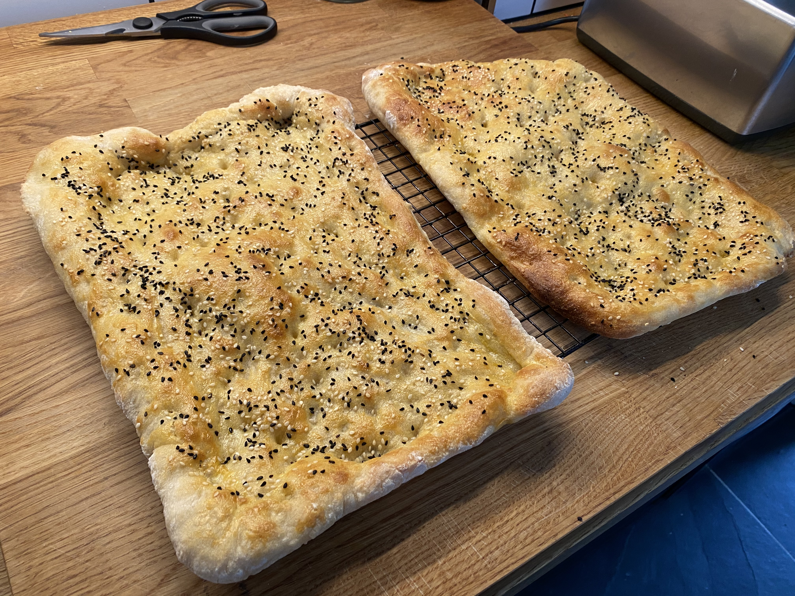

# Pide

> This is a Turkish bread that's great for making things like a yogurtlu kebab – or just as a general BBQ side.

## Attributes

- Servings: 2 large Pide
- Prep time: 20 minutes, plus about 2 hours total rising time
- Cooking time: 10 minutes

## Equipment

- 2 large baking trays
- Baking paper

## Ingredients

- 500g plain flour
- 1 sachet (about 7 grams) dried yeast
- 1 teaspoon salt
- 1 teaspoon sugar
- 375ml warm water (about 40 degrees)
- 2 teaspoons sesame seeds
- 1 teaspoon nigella seeds
- 1 egg yolk
- 1 tablespoon olive oil (plus extra for greasing)

## Method

1. Combing the flour, yeast, sugar and salt in a bowl, then add the water. Stir until it comes together into a wet dough.
2. Turn out the dough on on to a floured surface. Knead for about 15 minutes, until smooth.
3. Place the dough in a clean, oiled bowl. Cover with a damp towel, then set aside in a warm place for 60–90 minutes until roughly doubled in size.
4. Turn the dough out onto a floured surface and cut in half. Flatten each half out slightly, then place onto two separate pieces of floured baking paper – each large enough to cover the baking trays. Cover with a damp towel and leave for about 15 minutes.
5. reheat oven to about 230C, then stretch each piece of dough out until it's roughly the size of the baking sheet. Take care to leave a little bit of volume around the edges – this will help it to form a nice light texture in the oven. Leave on the baking paper, cover with the damp towel again and set aside for 15 minutes.
6. Combine the egg yolk and oil in a small bowl, then brush all over both flatbreads. Use your figers to make some small indentations all over each of them – then combine the nigella and sesame seeds and srinkle evenly on top.
7. Place each flatbread on a baking tray and into the oven. Cook for about 8–10 minutes, until cooked and goden brown. Remove to a wire rack and allow to cook for a few minutes, before slicing into rough rectangles.
