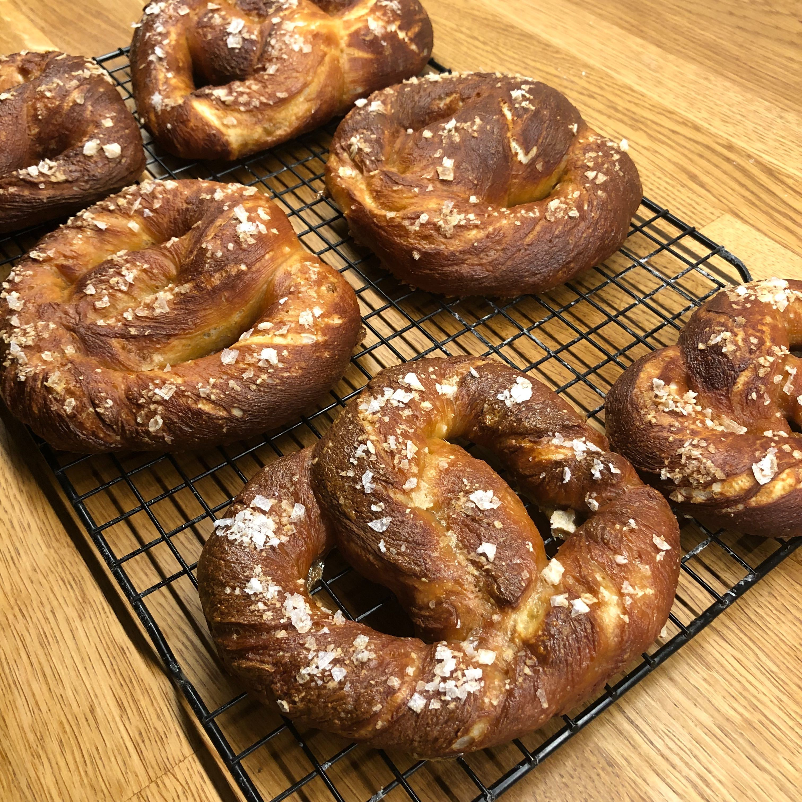

# Pretzels

> A basic pretzel recipe that's not totally traditional, but comes out with something quite tasty

## Attributes

- Servings: 8 pretzels
- Prep time: 30 minutes + 1 hour rising time
- Cooking time: 30 minutes

## Ingredients

- 200g white bread flour
- 280g plain flour
- 350ml warm water (40-ish degrees)
- 1 tablespoon sugar
- 1 teaspoon salt
- 7g sachet active dry yeast
- 50g melted butter
- 1 egg
- sea salt flakes for topping
- 100g bicarbonate of soda

## Method

1. Combine warm water, salt, sugar and yeast in a mixing bowl and stir to combine. Set aside for five minutes while the yeast starts to work.

2. Combine the yeast mixture with the flours and melted butter. Stir until everything is incorporated and the dough starts to pull together.

3. Turn out onto a floured surface and knead for about 10 minutes (or use a mixer!) until smooth and elastic.

4. Place the dough back into a well-oiled mixing bowl and leave in a warm place to rise until doubled in volume – up to 1 hour.

5. Pre-heat the oven to 200C. Prepare enough appropriately-sized baking pans with baking paper, and oil thoroughly.

6. Place the bicarbonate of soda in a large saucepan and add about 2 litres of water. Bring to the boil, then turn off the heat.

6. While the water is heating, make the pretzels. Divide the dough into two halves, then divide each half into quarters.

7. Roll each dough ball out into a long sausage shape. These should be about 40cm long once they're rolled out. Twist the dough to give it a bit of a spiral, then form it into a U-shape. Take one end in each hand, cross them over once, then pinch them on to the other side to form a pretzel shape.

8. Place each pretzel face-down in the hot water and leave for about 45 seconds. Remove and drain on some kitchen paper.

9. Place pretzels onto a prepared baking tray. Beat the egg and add a tablespoon of milk or water, then brush thoroughly all over. Sprinkle generously with sea salth flakes.

10. Bake for about 15-18 minutes until they're dark golden brown, then remove and leave to cool on a wire rack.
