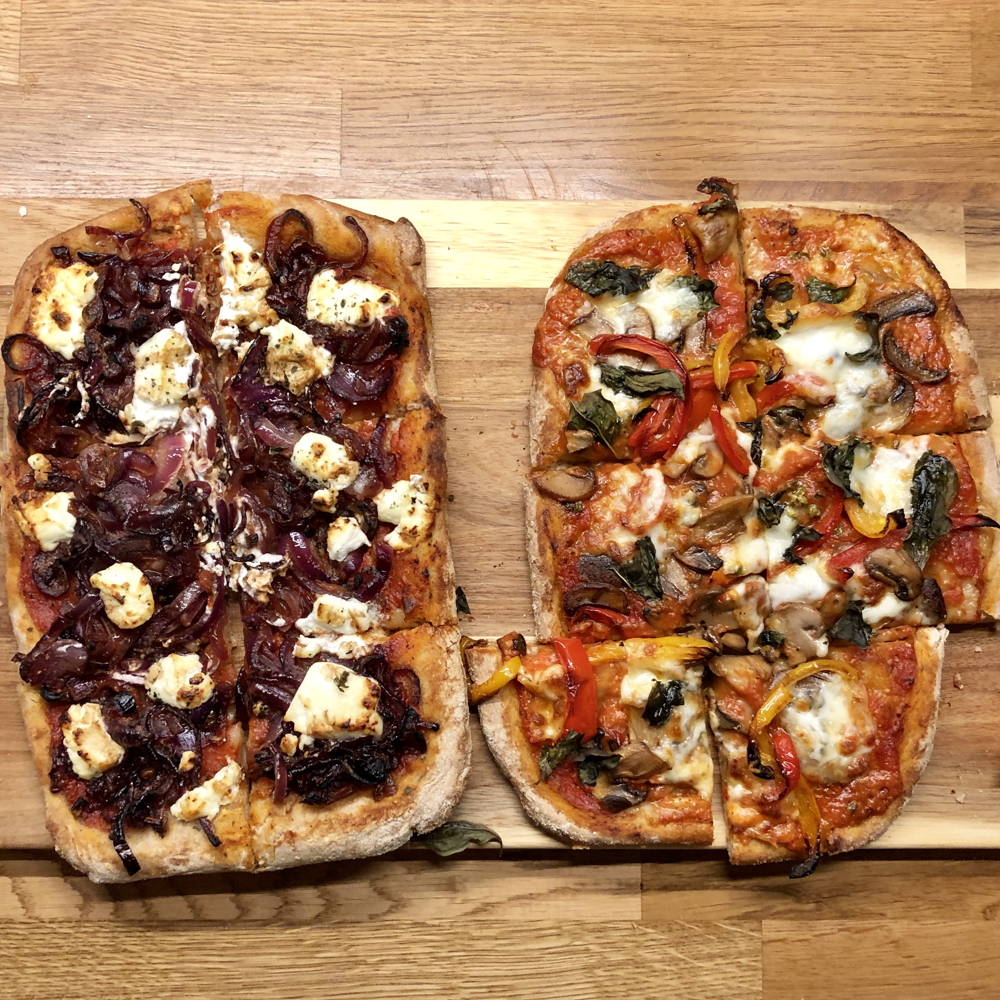

# Sourdough pizza bases

> These need to be baked at as high a temperature as possible! I've included a basic tomato sauce recipe that you can also use as a topping base.

## Attributes

- Servings: about 4 pizza bases
- Prep time: 1 day
- Cooking time: 15 minutes or so

## Ingredients

### For the pizza base

- 200g sourdough starter – the less well-fed the better
- 450g warm water
- 580g bread flour
- 15g sea salt
- Polenta for baking

### For the tomato sauce

- 1 can peeled, whole tomatoes
- 1 tablespoon extra virgin olive oil
- 1 teaspoon dried oregano
- 1 teaspoon sea salt

## Method

### Pizza bases

1. Combine starter, water, flour, and salt in a large bowl. Stir well until a rough, loose, sticky dough is formed.
2. Turn out onto a lightly floured surface, then knead thoroguhly—adding a little more flour if needed—until a smooth and elastic ball of dough is formed. This should take about 10 minutes.
3. Store in the fridge, and leave to rise for at least 8 hours. The dough can be prepared up to 4 days in advance.
4. After the proof has completed, and 5 hours before baking, divide the dough into four qual portions and shape into tight balls. Place in a lightly oiled proofing container, like a high-walled baking dish, and leave on the counter.
5. When ready to bake, preheat the oven to the hottest you can make it. Make sure your topping ingredients are ready, then gently remove the proofed dough balls from the container and place on a lightly floured work surface.
6. With each ball in turn, lay out a sheet of baking paper and lightly scatter with polenta. Gradually flattening out the ball into a pizza-sized disc, taking care to avoid pressing the air out of a crust at the rim – this is the bit you want to be puffy.
7. Add the toppings, and immediately place in the oven. Bake until cooked to your liking, then remove from the oven and serve.

### Tomato sauce

1. Drain the tomatoes and place into a blender. You can keep the reserved liquid and use in a variety of other recipes.
2. Blend until a reasonably smooth consistency, then taste and season as required.
3. Use as required, storing any remaining sauce in the fridge for up to a week.
