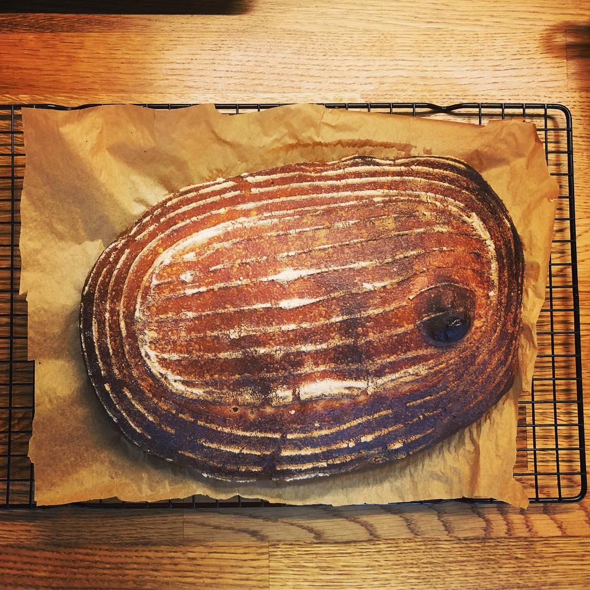

# Sourdough loaves

> As a rule, I'm terrible at making a reliable sourdough. But this recipe is pretty good and I've had some decent loaves out of it.

## Equipment

- 2x bread proofing baskets
- Dough scraper

## Attributes

- Servings: 2 loaves
- Prep time: 1 day
- Cooking time: 30–40 minutes

## Ingredients

### For the leaven

- 100g strong white bread flour
- 100g whole wheat flour
- 1 tablespooon active starter
- 200g warm water (40C)

### For the bread

- 200g leaven
- 900g strong white bread flour
- 100g whole wheat flour
- 20g sea salt
- 100g rice flour
- 750g warm water

## Method

1. Make the leaven the night before baking the loaves. Mix 1 tablespoon of the active starter with 200g of warm water and stir to disperse. Add the white and whole wheat flours, and combine well. Cover with a damp cloth and allow to sit at room temperature for about 12 hours. To test its readiness, drop a tablespoon into a bowl of room-temperature water. If it floats, it's ready – otherwise you'll need to give it more time.

2. To make the bread, combine 200g of leaven with 700g of the warm water and stir to disperse. Reserve the remaining leaven for other uses. Add the white bread flour and whole wheat flour, and mix until no dry material remains. Cover the bowl with a towel and leave to rest for 30-45 minutes at room temperature.

3. Add the sea salt and a further 50g of warm water. Use your hands to thoroughly mix the salt and water into the dough – it will start to fall apart but if you keep mixing it will come back together. Cover with a towel and transfer to a warm environment about 25-27C and leave for 30 minutes.

4. After the dough has risen, fold it by taking hold of the underside of the dough ball at each corner and stretching it over the rest of the dough. Do this four times – once for each corner. Repeat the folding action for another 2.5 hours, every 30 minutes. After this, the dough should be light and about 30% larger in volume.

5. Transfer the dough to a work surface and dust with flour. Use a scraper to split into two parts, and flip them over so they are flour-side down. Fold the cut side up on itself, so that the flour remains on the outside. Work into tight rounds, then cover with a towel and rest for 30 minutes.

6. Line two bread-proofing backets with towels and flour them using some of the rice flour.

7. Dust the rested round with some whole wheat flour. Use the dough scraper to flip them over so that the floured sides are have down again. Fold the four corners into the middle of the dough again, so the flour is on the outside. Flip so that the fold is on the bottom, then shape into a smooth round ball. Repeat with the other round.

8. Transfer rounds to the prepared baskets, seam-side up. Cover and return to the warm environment for another three to four hours, or alternatively leave in the fridge for 10-12 hours.

12. Pre-heat the over 30 minutes before baking. Use a dutch over or other heavy, lidded pot, and heat to 260C or as close as you can get. Dust the loaves in the baskets with a little more rice flour, then carefully remove the dutch oven and place the loaf in the pan, seam-side down. Score the top of the load using a lame to allow the crust to expand, then cover and transfer to the oven. Immediately reduce the temperature to 230C. Bake for 20 minutes covered, then remove the lid and bake for another 20 minutes. The load is ready when the crust is a rich brown shade.

13. Move the bread to a cooling rack and wait 15-20 minutes before slicing.
