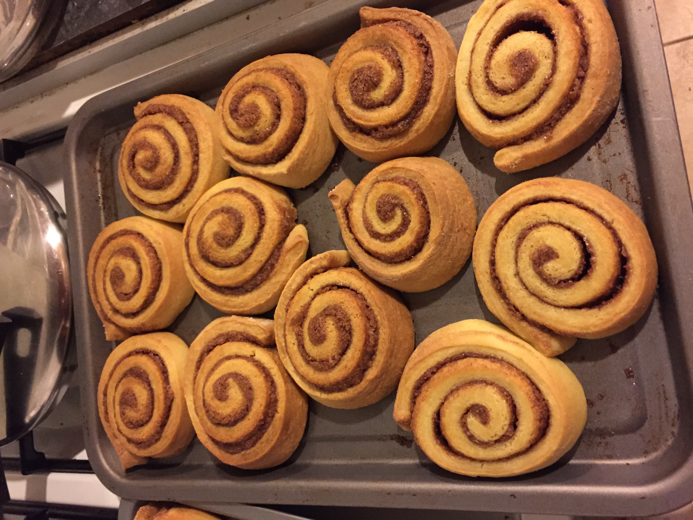

# Cinnamon rolls

> I don't know where this came from, but I remember I made these for Nick and Jenny's wedding.

## Attributes

- Servings: 12
- Prep time: 1 hour 30 minutes
- Cooking time: 30 minutes

## Ingredients

- 15g dried active yeast
- 210g caster sugar
- 1 tablespoon salt
- 450ml warm warm water (about 45C)
- 800g plain flour
- 2 eggs
- 5 tablespoons vegetable oil
- 2 tablespoons ground cinnamon

## Method

1. In a large mixing bowl, dissolve the yeast and 100g of sugar in the warm water. Stir in the salt and 400g of plain flour. Beat for 2 minutes until it starts to come together, then beat in the eggs and oil. Stir in the rest of the flour a little at a time, beating well after each addition, until thoroughly combined.

2. When the dough comes together, tip it out onto a lightly floured surface and knead until it's smooth and elastic – this takes about 5 minutes. Lightly oil a large bowl, then place the kneaded dough inside and turn until it's coated with oil. Cover with a damp cloth and leave in a warm place until it doubles in volume – this should take about 45 minutes.

3. Mix together the remaining sugar and cinnamon in a small bowl and set aside.

4. When the dough has risen, tip it out onto a lightly floured surface and roll into a rectangle roughly 1/2 cm thick and 30cm long. Spread the cinnamon mixture on top, then roll up widthwise to form a long spiral log. Slice the log into 12 equal parts, and place into a lightly greased 25x30cm baking tin. Cover with a damp cloth and leave to rise until doubled in volume again – another 45 minutes or so.

5. Meanwhile, preheat the oven to 180C/fan 160C, then bake for 30 minutes until golden.
