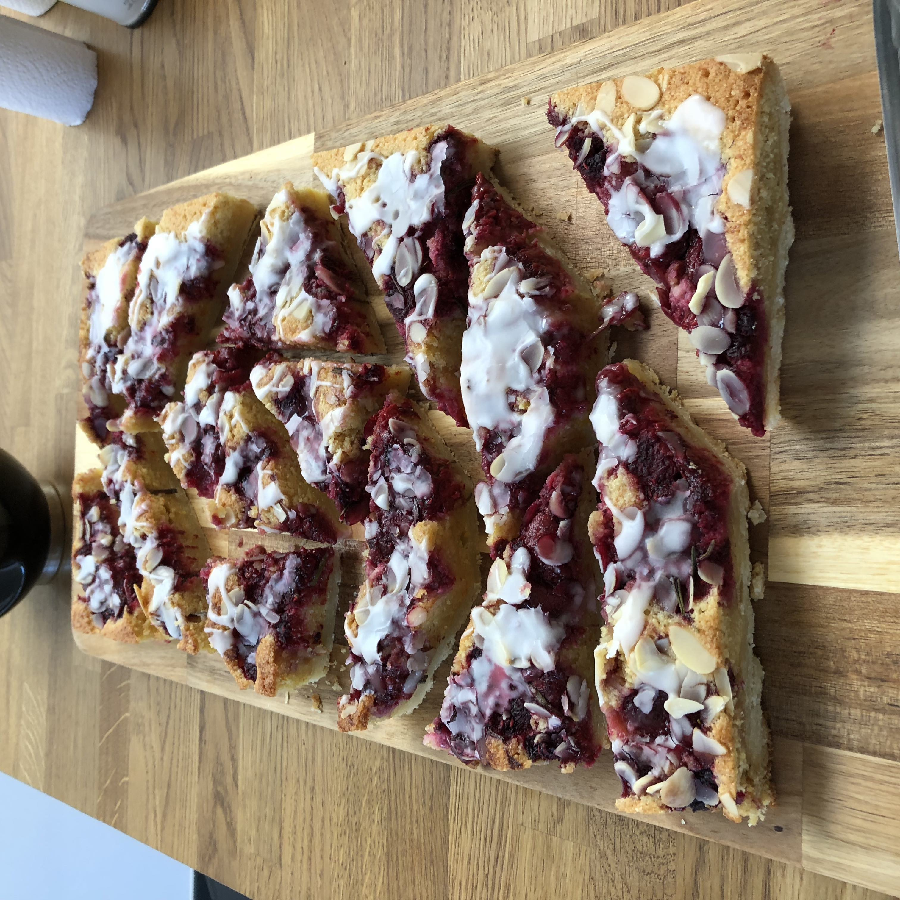

# Italian-style Bakewell Tart

> This is a tasty alternative take on a Bakewell tart using raspberries instead of cherries. It's best served by cutting it into random, shard-shaped slices.

## Attributes

- Servings: 16-18
- Prep time: 30 minutes
- Cooking time: 1 hour plus cooling time

## Equipment

- Baking tray – around 25cm x 35cm
- Baking paper

## Ingredients

### Filling

- 600g raspberries
- 2 sprigs rosemary
- 20g icing sugar (sifted)
- 500g butter shortcrust
- 30g flaked almonds

### Frangipane

- 200g unsalted butter at room temperature
- 200g golden caster sugar
- 4 large eggs
- 2 oranges
- 2 lemons
- 2 teaspoons almond extract
- 200g ground almonds
- 40g plain flour

### Icing

- 75g icing sugar
- 25ml limoncello

## Method

1. Preheat the oven to 180C/fan 160C.

2. Place the raspberries in a bowl, mix in the leaves stripped from the rosemary sprigs, and sprinkle over the icing sugar. Set to one side and leave for 30 minutes.

3. Make the frangipane – cream together the butter and caster sugar, then beat in the eggs. Finely grate the orange and lemon zest into the mixture, then add the almond extract. Gently fold in the ground almonds and flour. Set aside.

4. Roll out the pastry on a lightly floured surface to a rectangle large enough to cover the baking tray, enough to cover the bottom and slightly ascend the sides. PLace on the greased baking tray, then bake in the oven for 15 minutes. Remove when it's done, and lower the over temperature to 160C/fan 140C.

5. Spread the frangipane over the pastry, then distribute the raspberry mixture unevently across the surface. Sprinkle over the flaked almonds. Bake in the oven for 30 minutes then remove and allow to cool slightly.

6. Combine the remaining icing sugar and limoncello in a small bowl, and mix until smooth. Drizzle over the cooled tart, then slice and serve.
