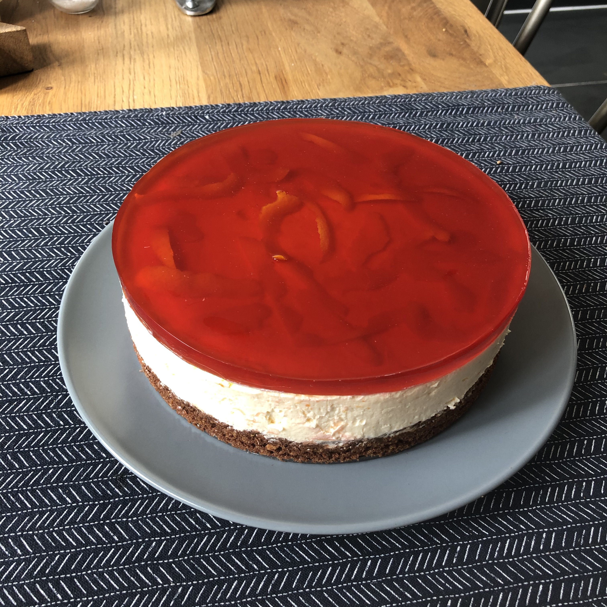

# Negroni cheesecake

> This is an amazing cheesecake recipe with a great visual impact. I've also made it using limoncello, and swapping out the oranges for lemons. I bet you could do a nice gin and tonic one too!

> Other bases work too – I've also done 125g sugar + 250g oats for a gluten-free version.

## Attributes

- Servings: 10-12
- Time: 30 minutes, plus 4 hours of chilling and 3 hours to set

## Equipment

- Deep, 20cm, loose-bottom cake tin
- Pallette knife

## Ingredients

### For the base

- 100g melted butter
- 180g Loaker Napolitaner wafer biscuits
- 50g blanched hazelnuts, toasted to golden

### Fot the filling

- 600g cream cheese
- 80g caster sugar
- 3 oranges
- 200ml double cream
- 6 gelatine leaves
- 200ml chilled Negroni

## Method

1. Heat the oven to 160C. Pulse the hazelnuts in a food processor until roughly chopped, then add the biscuits and whizz until combined. Pour in the butter and a pinch of salt. Combine, then spoon into the tin and press down firmly. Bake for 10 minutes.

2. Mix the cream cheese, sugar, and zest of two oranges in a large bowl. Whisk the cream to soft-peak in a separate bowl, then fold into the cream cheese. Spoon into the base and chill for 4 hours.

3. Once set, soak the gelatine in a small bowl of cold water for 5 minutes to soften it up. Warm 100ml of the Negroni with a few large strips of zest from the remaining orange. When the gelatine has softened, squeeze out the excess water from each leaf and whisk into the warm Negroni. Once dissolved, mix in the chilled Negroni then pour over the cheesecake. Leave in the fridge for 2-3 hours.

4. To serve, run a knife round first then decant to a plate.
