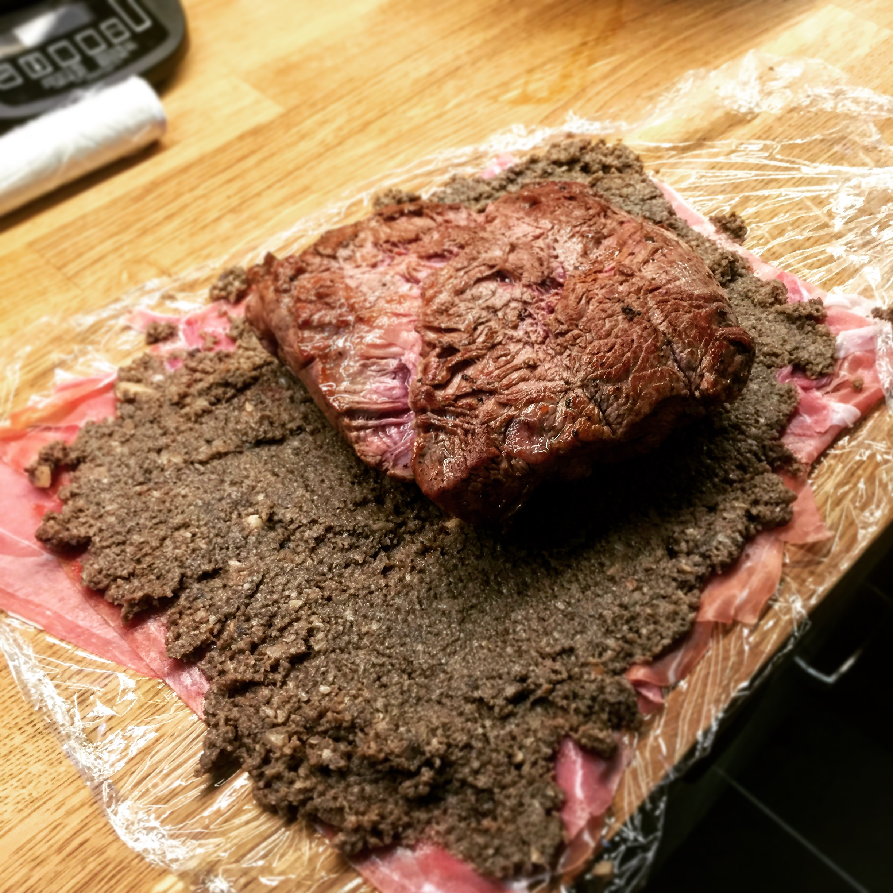

# Beef Wellington

> I think the basics of this are from a Gordon Ramsay Sunday lunch cookbook that I've had forever – but it's a pretty standard recipe. I used to cook this for basically every Christmas, since it's a bit more fun than the usual turkey or simple roast, and it always goes down a treat.

## Attributes

- Servings: 6
- Prep time: 1-2 hours
- Cooking time: 1-2 hours

## Equipment

- Roasting tray
- Large frying pan
- Cling film
- Large baking sheet

## Ingredients

- Around 1kg beef fillet
- 3 tbsp olive oil
- 250g chestnut mushrooms
- 50g butter
- 1 sprig thyme
- 100ml white wine
- 12 slices prosciutto
- 500g ready-to-roll puff pastry
- Flour for dusting
- 2 egg yolks beaten with 1 teaspoon milk

## Method

1. Heat oven to 220C/fan 200C. Place the beef on a roasting tray, brush with 1 olive oil and season with pepper, then roast for 15-20 minutes for a medium-rare Wellington – cook a little longer if you prefer it more well-done. When cooked, remove from the oven and chill in the fridge for about 20 minutes.

2. While the beef chills, chop the mushrooms to the texture of coarse breadcrumbs. If you're using a food processor, be careful not to overdo it and turn the mushrooms into a paste!

3. Heat a glug of olive oil and the butter in a large pan with the thyme, and fry the mushrooms at a medium heat for 10 minutes until they soften keep stirring it frequently. Season with salt and petter, then pour over the wine and cook for another 10 minutes until the wine has cooked down. The mixture should have a reasonably firm texture, and roughly hold its shape when stirred. Remove from the heat to cool, and discard the thyme.

4. Lay a piece of clingfilm flat, and arrange the proscuitto slices in two rows, slightly overlapping, so that they will completely encase the beef fillet when rolled around. Spread the mushroom mixture evenly over the proscuitto, then place the beef on top. Use the cling film to wrap the proscuitto and mushrooms around the fillet, starting from one end, to create a sausage shape. Twist the ends of the cling film closed, then place the fillet back in the fridge to chill.

5. Dust your work surface with a little flour. Roll out 1/3 of the pastry to a rectangle around 20cm x 30cm, and place on a baking sheet lined with baking paper. Roll the rest of the pastry out to a rectangle around 30 x 40cm and set aside. Remove the beef fillet from the cling film and gently place on top of the smaller sheet of pastry. Use the beaten eggs to brush the edges of the pastry, then gently place the larger portion of pastry on top of the fillet. Trim the edges so there's a rim of about 4cm, then press together using the handle of a spoon. Glaze all over with the beaten egg, then carefully score the pastry on top, diagonally, taking care not to slice through. Chill for at least an hour.

6. Heat the over to 200C/fan 180C. Brush with a little more egg yolk, then cook until ready – usually about 20-25 minutes for a medium-rare, or 30 minutes for more well-done. Remove from the oven, then stand for 10 minutes before slicing and serving.
