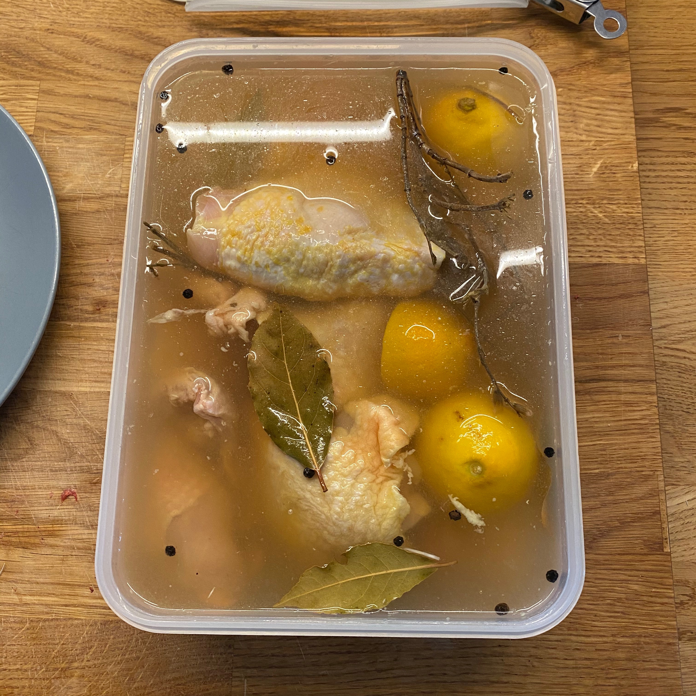
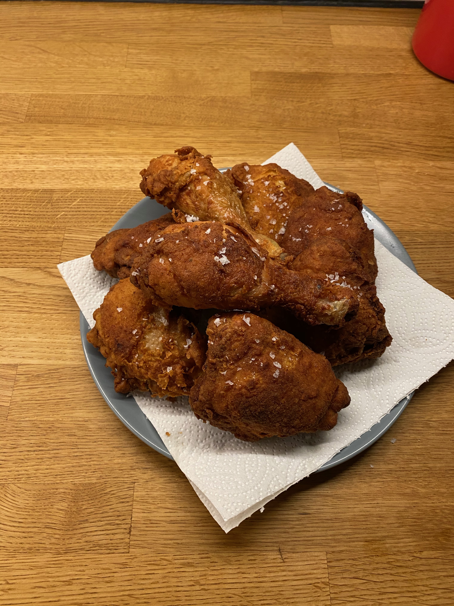

# Fried Chicken

> This is an absolutely classic fried chicken recipe. It's the result of trying a few different approaches over the years; this one is the absolute best.

## Attributes

- Servings: 3-4 people
- Prep time: about 30 minutes overall, plus 12 hours of brining time and several hours of cooling time
- Cooking time: About 30 minutes

## Equipment

- Large, deep pan for frying
- High temperature thermometer

## Ingredients

- Around 8 pieces of skin-on, bone-in chicken – thighs or legs
- Sunflower, vegetable or peanut oil for deep frying

### For the brine

- 3 lemons cut in half
- 4-5 bay leaves
- about 30g thyme
- about 30g rosemary
- 75ml honey
- 1 garlic bulb sliced in half through the center
- 30g black peppercorns
- 150g salt
- 4 litres of water

### For the coating

- 360g plain flour
- 40g garlic powder
- 40g onion powder
- 1 tablespoon paprika
- 1 tablespoon cayenne pepper
- 1 tablespoon salt
- 1 litre buttermilk (or 1 litre of regular milk plus 4 tablespoons of lemon juice, left to sit for 5 minutes)

## Method

1. Start by preparing the brine – you might want to do this the day before, because it needs to be chilled before you use it. Combine all of the ingredients in a large pot and bring to the boil. Let it boil for a couple of minutes, then turn off the heat. Allow the brine to cool before using, then put it in the fridge and make sure it's completely chilled before using.
2. When the brine is ready to use, add the chicken pieces and cover completely. Leave to brine for 12 hours – any more than this and it might start to get a bit too salty.
3. Remove the chicken from the brine, rinse under cold water, and pat dry with kitchen towel. Leave out for 60–90 minutes to allow it to come to room temperature.
4. Prepare the oil. Fill your pan with at least 5cm of oil, then bring it up to 160C.
5. Prepare the coating station. Combine all the ingredients except for the buttermilk in a large bowl, then split it into two smaller bowls. Fill a third bowl with the buttermilk.
6. Immediately before starting to fry the chicken, dredge each piece in one bowl of coating, then the buttermilk, then the second bowl of coating Place on a plate ready to be fried. Prepare a cooling rack.
7. Lower the chicken into the oil, and keep an eye on the temperature – it will drop, and you want to return it to as close to 160C as you can. Leave the chicken alone for two minutes, then carefully move around a little bit to prevent sticking. Continue to fry for about 10 minutes or until ready, then transfer to the cooling rack. Keep the thighs skin-side up to help the fat drain.
8. Repeat as required until all the chicken is cooked, then plate up, sprinkle with some sea salt, and serve.
