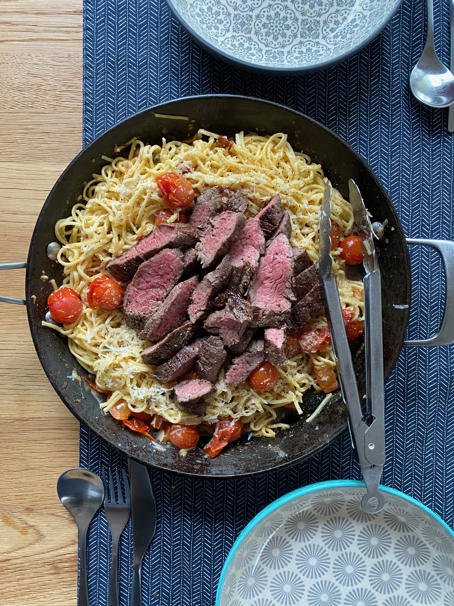

# Pasta Puttanesca

> This is a great way to use up some random meat. I don't know how real or genuine this is as a pasta dish really. The only reason I actually made it was when I had some spare pasta and steak over the COVID-19 lockdown, and was trying to come up with something that could use all my excessive food up.

## Attributes

- Servings: 3-4 people
- Prep time: 10 minutes
- Cooking time: 30 minutes

## Equipment

- Large frying pan

## Ingredients

- 600–700g steak. I like using flank/bavette.
- 350g pasta. Spaghetti or tagliatelle work well.
- 1 tablespoon butter
- 4 cloves of garlic
- 500g cherry tomatoes
- 2 tablespoons capers
- 100g grated parmesan cheese

## Method

1. Prepare the steak and pasta however you like. Reserve 200ml of pasta waster for the sauce.
2. Add the butter to a hot pan, then the garlic, tomatoes, and capers. Fry for a few minutes, until nice and aromatic and the tomatoes are starting to wrinkle.
3. Add the pasta, reserved water, parmesan and toss together. Salt an pepper to taste.
4. Slice the steak and serve on top of the pasta.
