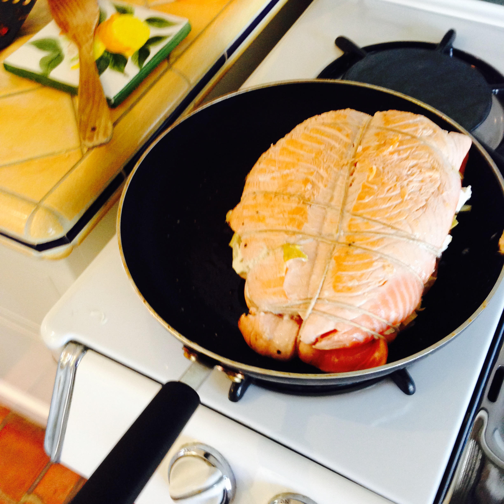

# Salmon En Croute

> This is a bit fiddly to make, but it's really nice when it all comes together.

## Equipment

- Kitchen string

## Attributes

- Servings: 8
- Prep time: 20 minutes
- Cooking time: 30 minutes

## Ingredients

- 2 large salmon fillets, about 450g each
- 125g speadable goats' cheese
- 175g artichoke hearts in oil
- Olive oil
- 500g all-butter puff pastry
- 1 egg beaten with 1tbsp water, to glaze

## Method

1. Place a salmon fillet on a shopping board, skinned size down. Spread the goats' cheese over the fillet and season thoroughly with salt and pepper. Arrange the artichoke hearts over the top, pressing down slightly. Arrange the other salmon fillet on top, and tie at 5cm intervals using kitchen string.

2. Heat a lug of olive oil in a frying pan that's large enough to contain the fillets. When the oil is hot, add the fillets and fry for a short time on each side until sealed. Remove from the pan and allow to cool.

3. Preheat the oven to 220C/fan 200C, and lightly butter a large baking sheet. Lightly dust the work surface with floud, then roll out the pastry sheet until it's approximately 38cm wide and 10cm longer than the salmon. PLace the salmon on top and remove the strings. Brush the pastry edges with water and wrap around the salmon, pincing the edges together to enclose the fish. Trim off any excess pastry at the corners.

4. Brush with the egg wash, making sure to get the sides as well as the top. Score the surface lightly with a sharp knife, making sure not to cut through, then bake for 25-30 minutes until risen and golden brown. Transfer to a serving plate and serve in thick-cut slices.
