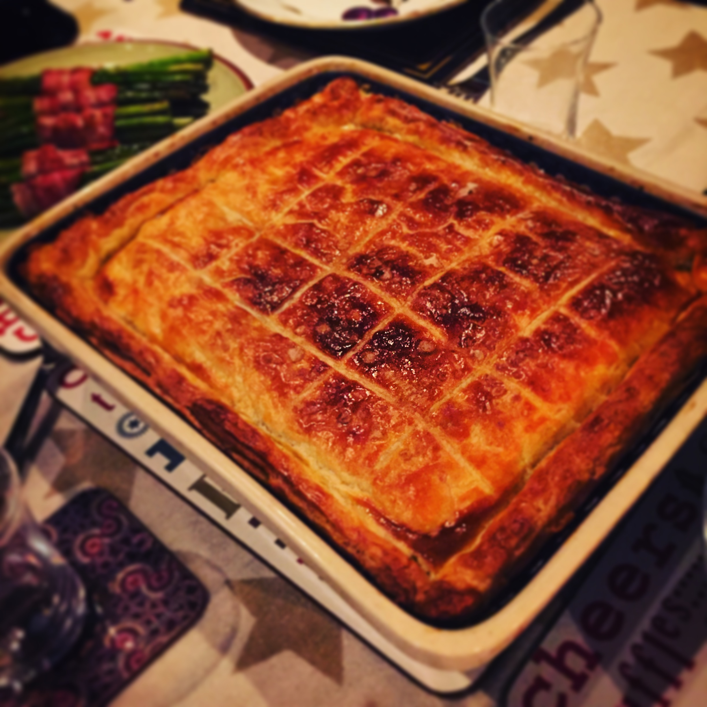

# Steak Pie

> My grandmother tells me that when she was younger, steak pie was the recipe used for any special occasion. New year's day, weddings, and so on. This is my own recipe for a large steak pie that's suited for up to eight people, with the secret magic being a layer of cheese under the crust…

## Attributes

- Servings: 8
- Prep time: 30 minutes
- Cooking time: 3 hours

## Equipment

- 25x30cm pie dish, about 4-5cm deep

## Ingredients

- 1kg of beef steak. Skirt, flatiron or rump are best.
- 50g butter
- 3 red onions, peeled and finely chopped
- Leaves from 3 sprigs of fresh rosemary, finely chopped
- Leaves from 3 sprigs of fresh thyme
- 3 fresh bay leaves
- 500g chestnut mushrooms, cleaned and sliced
- 2 tablespoons tomato purée
- 3 tablespoons balsamic vinegar
- 1 tablespoon Worcestershire sauce
- 500ml stout
- 3 tablespoons of plain flour
- 500ml beef stock
- 1 large egg beaten with 1 teaspoon of milk
- 500g all-butter puff pastry
- 150g sharp cheddar cheese, sliced

## Method

1. Place a large pan over a medium high-heat and add the butter. When it's sizzling, add the onions and herbs. Cook for around 20 minutes until soft and starting to brown.

2. Slice the steak into 2-3cm chunks and add to the pan. Stir for one minute, then add teh musherooms, tomato purée, vinegar, beef, flour, stock and Worcestershire sauce. Season well with salt and pepper, then bring to the boil. Reduce the heat, then cover and simmer for 1 hour and 20 minutes, stirring occasionally until the sauce has thickened and the meat is tender.

3. Preheat the oven to 180C/fan 160C. Roll out the pastry on a lightly floured work surface into a sheet suitable for covering the pie dish. Transfer the cooked stew to the pie dish, then lay the slices of choose on top.

4. Lay the pastry on top of the filled pie dish, then trim any excess and pinch the edges so that it's nice and tidy. Brush the top with the egg wash, then bake for 45-50 minutes until the pastry is golden.
