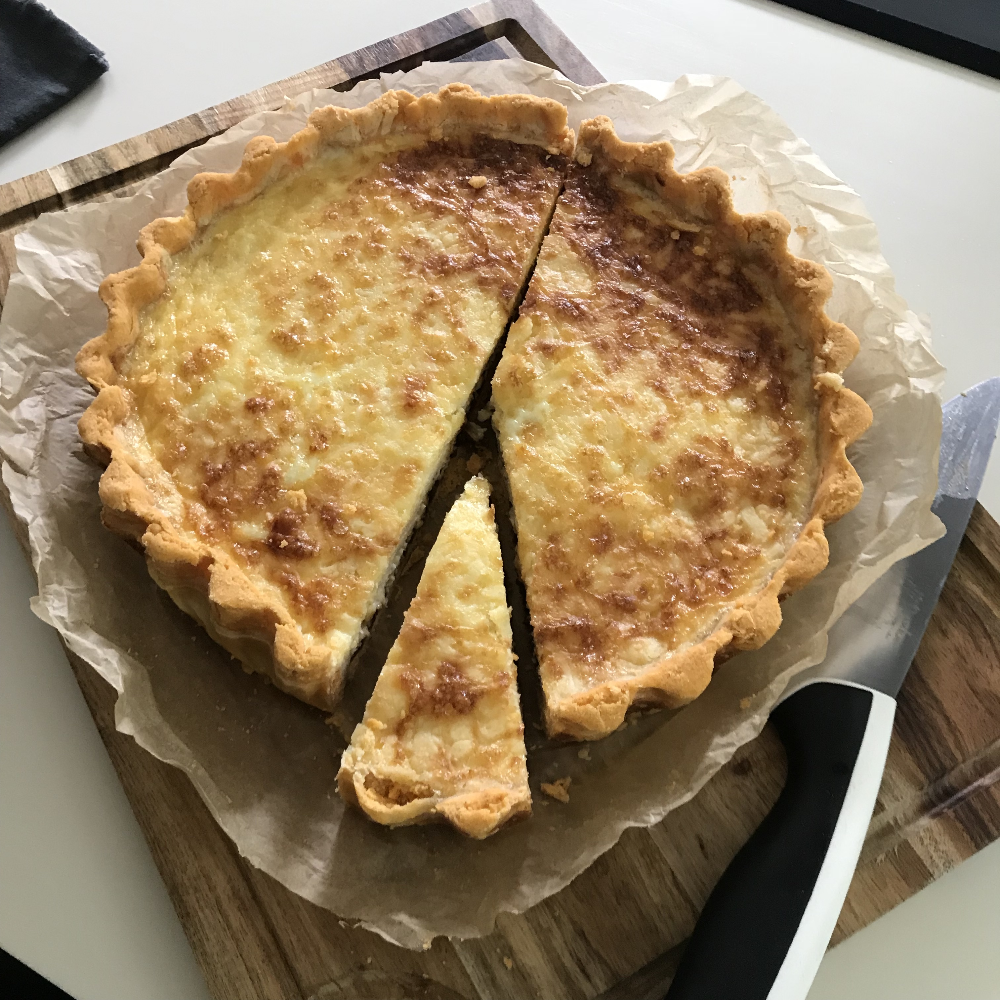

# Cheese and pickle tart

> This based on a Nadiya Hussain recipe, and it's great warm or cold. You can swap out the pickle for a variety of different fillings caramelised onion chutney is also great.

## Attributes

- Servings: 8
- Prep time: 30 minutes plus 15-30 minutes chilling time
- Cooking time: about 1 hour 15 minutes

## Equipment

- Large, loose-bottomed fluted flan tin (about 25 cm in diameter, and 3-4cm deep)
- Ceramic baking beans
- Baking paper

## Ingredients

- 350g shortcrust pastry
- 2 teaspoons smoked paprika
- 4 medium eggs
- 150ml full-fat milk
- 200g small-chunk sandwich pickle (or alternative filling)
- 250g grated mature cheddar
- A little butter

## Method

1. Dust a little flower over your work surface, then take the shortcrust pastry, flatten slightly, and sprinkle the paprika over. Fold the edges over so the paprika is inside, then knead the pastry until the paprika is distributed throughout. You don't have to get it totally even – a bit of marbling makes the tart look great.

2. Wrap the pastry in some cling film, and chill in the fridge for 15-30 minutes. Pre-heat the over to 180C/160C fan, and place a baking tray inside to warm.

3. Dust your work surface with a little more flour, then roll the pastry out into a rough circle that's large enough to cover your flan tin.

4. Rub a little butter over the inside of your flan tin, then line the tin with your pastry, leaving a little bit of overhang around the edges. Make sure it's pressed firmly into the flutes, but don't cut off the overhanging pastry just yet. Pierce the surface all over with a fork.

5. Cover the top of the pastry with a large sheet of baking paper, then place the baking beans on top. Pop the tin in the oven on top of your hot baking tray for 25 minutes, then take it out and remove the baking paper and beads. Bake it for another 15 minutes until it's just a touch golden around the edges.

6. While the case is baking, gently beat together the eggs and milk. Remove the pastry case from the oven, and spread the pickle or other filling evenly across the bottom of the case. Spread the grated cheese over then filling, then pour the egg mixture on top.

7. Place back in the oven and bake for 25-30 minutes until the filling is set, and there's just a little bit of wobble in the middle. Then remove from the over and place on a cooling rack.

8. Once the tart has cooled a little, slice off the overhanding pastry using a sharp knife. Leave to cool in the tin for about 30 minutes, then remove the tin and transfer to the rack to cool completely.
