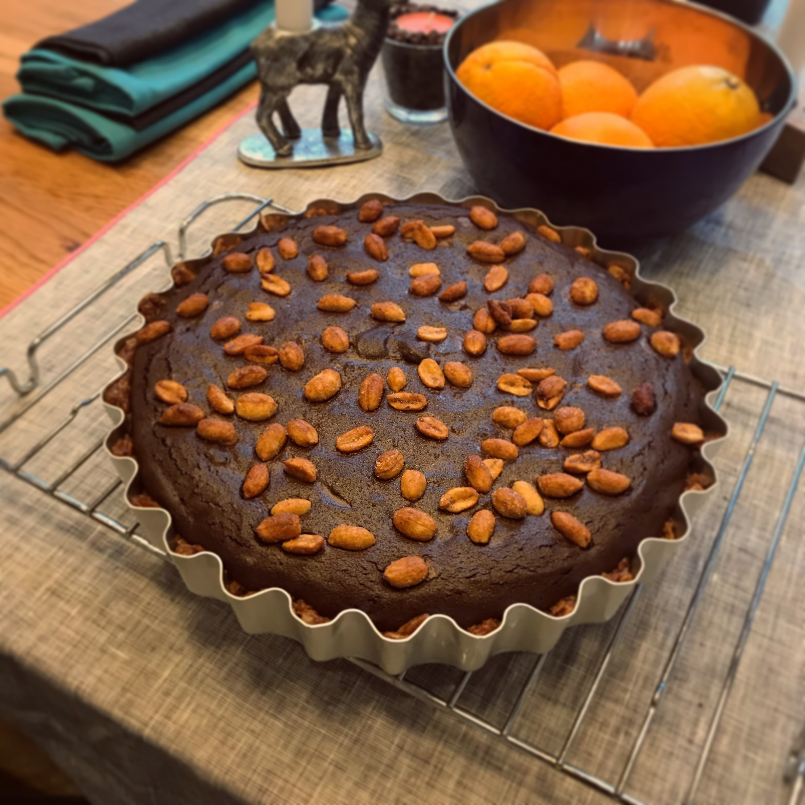

# Chocolate and Crisp Tart

> This is based on an insane Nadiya Hussain recipe I saw on TV, and it's amazing. It's a basic rich chocolate tart, but with a base made from crushed-up ready-salted crisps.

## Attributes

- Servings: 10-12
- Prep time: 30 minutes, plus about 4 hours to chill
- Cooking time: about 45 minutes

## Equipment

- Large, loose-bottomed fluted flan tin (about 25 cm in diameter, and 3-4cm deep)
- Ceramic baking beans
- Baking paper
- Food processor

## Ingredients

### For the base

- 250g thick-cut ready-salted crisps
- 100g butter
- 4 tablespoons golden syrup

## For the filling

- 250g butter
- 400g dark chocolate
- 3 eggs + 3 additional egg yolks
- 150g golden caster sugar
- 150g roasted and salted peanuts, roughly chopped

## Method

1. Preheat the oven to 180C/160C fan, and grease the flan tin with a little butter.

2. Crush the crisps into the texture of coarse breadcrumbs in a food processor. Melt 100g of the butter in a small saucepan, then add the golden syrup. Combine the crisps and melted butter mixture in a large bowl and mix thoroughly.

3. Press the crisp and butter mixture into the flan tin, making sure to fill all of the flutes and keep an even thickness. Cover the top with baking paper and fill with the baking beaks, then place on an oven tray and bake for about 10 minutes. Remove from the oven, take out the paper and beans, then set to one side.

4. While the case is baking, prepare the filling – melt the remaining 250g of butter and the chocolate in a double-boiler, stirring gently until the chocolate has melted completely and is combined with the butter. Remove from the heat and let cool a little.

5. Whisk together the eggs, additional yolks, and the caster sugar in a large bowl. Keep beating the mixture until it starts to thicken, which might take a couple of minutes. Pour over the melted chocolate mixture and mix until it's completely combined, then stir in half of the peanuts.

6. Pour the chocolate mixture into the prepared case, then sprinkle over the remaining peanuts. Bake for around 20-25 minutes until the filling is set, with a slight wobble in the middle. Remove the tin from the oven and place on a wire rack to cool. Once it's cooled a little, place in the fridge to chill for about 4 hours.

7. Carefully remove the tart from the tin, and serve in very small slices!
